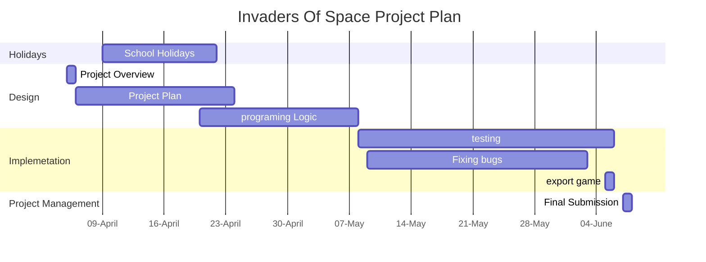

# Project Overview 
My game is a recreation of Space Invaders with my own custom player, enemies and weapons  
## Future Additions
Later in my game I plan on creating different enemies types that vary from weak and fast to strong and slow. I also plan on adding boss fights in some levels to create a challange for the player.
## Player and Enemy Weapons 
I want to give the players different type of weapons like missles, shotguns and lasers but to obtain these weapons the player must defeat a boss that  appears at the end of every 5th level.
# Behaviour - User Journey

# Planning Diagram - Project Plan

